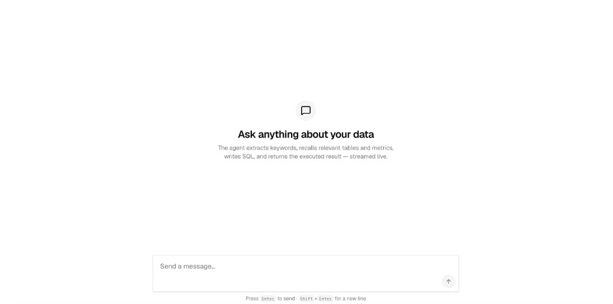
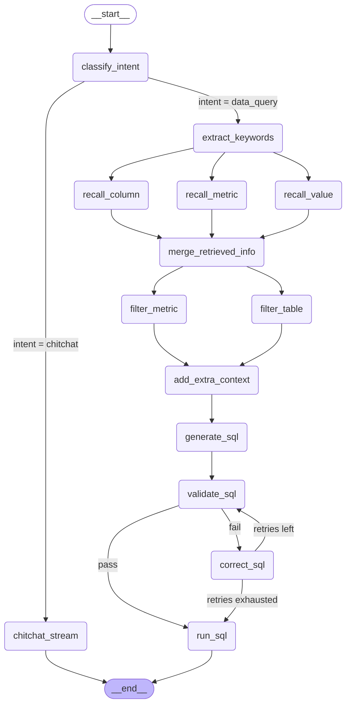

<div align="center">

# a-data-agent

**Chat with your data warehouse in plain language.**

A streaming, intent-aware AI data agent with a Vercel-style chat UI.
Ask "华北地区 AOV 是多少?" in Chinese (or "Top 10 products by sales"
in English) and the agent extracts keywords, recalls the right
columns / values / metrics from Qdrant + Elasticsearch, writes SQL,
executes it against the data warehouse, and streams the rows back
into the chat — all live, step by step.



</div>

---

## Table of contents

- [What it is](#what-it-is)
- [Agent graph (Mermaid)](#agent-graph-mermaid)
- [Highlights](#highlights)
- [Feature tour](#feature-tour)
  - [Intent routing — data query vs. chitchat](#intent-routing--data-query-vs-chitchat)
  - [Streaming LangGraph pipeline](#streaming-langgraph-pipeline)
  - [Live progress timeline](#live-progress-timeline)
  - [Hybrid schema recall (Qdrant + Elasticsearch)](#hybrid-schema-recall-qdrant--elasticsearch)
  - [Self-correcting SQL generation](#self-correcting-sql-generation)
  - [Vercel Chatbot-style chat UI](#vercel-chatbot-style-chat-ui)
  - [Cancel / stop mid-stream](#cancel--stop-mid-stream)
  - [Shared types & SSE protocol](#shared-types--sse-protocol)
  - [CORS-free Next.js proxy](#cors-free-nextjs-proxy)
- [Repository layout](#repository-layout)
- [Quick start](#quick-start)
- [Common commands](#common-commands)
- [Web app configuration](#web-app-configuration)
- [Backend configuration](#backend-configuration)
- [Tech stack](#tech-stack)
- [Adding a new workspace package](#adding-a-new-workspace-package)

---

## What it is

`a-data-agent` is a small but production-shaped Text-to-SQL agent
shipped as a **pnpm monorepo** (the Next.js chat app + shared
TypeScript types) plus a **standalone Python FastAPI service** (the
LangGraph data agent) that lives next to it.

The system has two halves that talk to each other over a single
`POST /api/query` SSE endpoint:

```
┌────────────────────────────┐         ┌────────────────────────────┐
│  apps/web (Next.js 16)     │         │ services/a-data-agent      │
│                            │  SSE    │  (Python 3.13 + LangGraph) │
│  Chat UI ── Composer ──▶   │ ──────▶ │  classify_intent           │
│  (Vercel style)            │ ◀────── │   ├─ chitchat_stream  ─▶   │
│                            │  events │   └─ extract_keywords      │
│  /api/query (proxy) ──────▶│         │       ├─ recall_column      │
│                            │         │       ├─ recall_value       │
│                            │         │       ├─ recall_metric      │
│                            │         │       ├─ merge_retrieved    │
│                            │         │       ├─ filter_*           │
│                            │         │       ├─ generate_sql       │
│                            │         │       ├─ validate_sql       │
│                            │         │       ├─ correct_sql        │
│                            │         │       └─ run_sql            │
└────────────────────────────┘         └────────────────────────────┘
                ▲                                   │
                │   shared contracts (@a-data-agent/shared)   │
                └───────────────────────────────────┘
```

## Agent graph (Mermaid)

The following diagram is generated **live** from the LangGraph
definition in `app/agent/graph.py` (via `graph.get_graph().draw_mermaid()`)
and reflects the actual nodes and edges in the running graph.



**How to read the diagram.** Every node is a LangGraph function in
`app/agent/nodes/`. Solid arrows are unconditional edges; arrows
**with a label** (`-- "label" -->`) are conditional branches whose
label names the condition the router actually checks. The graph
has two top-level conditional branches out of `classify_intent`
(`data_query` vs. `chitchat`) and two conditional branches around
the `validate_sql` / `correct_sql` loop (`pass` → `run_sql`,
`fail` → `correct_sql`; corrector re-validates while retries
remain, or falls through to `run_sql` after the budget is
exhausted).

## Highlights

- 🧠 **Intent router** — heuristic + LLM fallback decide whether your
  input is a data query or small talk, and skip the entire SQL
  pipeline when it isn't.
- ⚡ **True streaming** — every LangGraph node emits SSE events as it
  runs; the chat UI shows what's happening in real time.
- 🗄️ **Hybrid recall** — column / value / metric retrieval against
  Qdrant (vector) + Elasticsearch (full-text) + MySQL metadata.
- 🔁 **Self-correcting SQL** — generate → validate → correct → execute,
  with the validator's feedback re-feeding the corrector.
- 💬 **Vercel Chatbot-style UI** — clean shadcn/Tailwind chat surface
  with an inline gradient send / stop button, live progress timeline,
  jump-to-latest pill, and full dark mode.
- 🧩 **Single source of truth for the wire protocol** — the
  `@a-data-agent/shared` package owns the SSE event types so the
  browser, the Next.js proxy, and the Python backend can never drift.

---

## Feature tour

### Intent routing — data query vs. chitchat

**What it is.** The first node in the LangGraph is a fast intent
classifier. It looks at the user's input and decides whether the
agent should run the full data pipeline or just chat back directly.

**How it works.**

1. **Heuristic fast-path.** A small allowlist of patterns matches
   obvious chitchat inputs (e.g. `你是谁`, `hello`, `thanks`,
   `introduce yourself`). No LLM call, no cost.
2. **Data-hint veto.** Even if the heuristic weakly matches, the
   presence of _any_ data hint — words like `多少`, `top`, `gmv`,
   `order`, `表`, `字段`, … — overrides the chitchat guess.
3. **LLM fallback.** Anything that wasn't a clear chitchat is sent
   to a tiny JSON-mode LLM call (`prompts/classify_intent.prompt`)
   that returns `{"intent": "chitchat" | "data_query"}`. The
   fallback prompt is **biased toward `data_query`** — we'd
   rather over-run the pipeline than silently drop a real data
   question.
4. **Conditional edges.** The graph branches:
   - `chitchat` → `chitchat_stream` → `END`
   - `data_query` → `extract_keywords` → … → `run_sql` → `END`

**What the user sees.** A single `意图识别 / Classify intent` step in
the progress timeline. The `chitchat` branch then runs one step
(`闲聊回复 / Compose reply`) and returns; the data branch runs the
rest of the pipeline.

### Streaming LangGraph pipeline

**What it is.** Every LangGraph node writes structured progress
events to the SSE stream as it enters and exits. The chat UI can
paint a live timeline without polling.

**How it works.** Each node calls
`runtime.stream_writer({"type": "progress", "step": "<Chinese id>",
"status": "running"})` on entry and again with `status: "success" |
"error"` on exit. The terminal node (`run_sql` for data queries,
`chitchat_stream` for chitchat) writes a `result` or `answer` event
with the final payload.

**Why it matters.** The user never stares at a spinner for 30
seconds — they see "Recall columns" turn green the moment it
finishes, even if "Generate SQL" is still running.

### Live progress timeline

**What it is.** A collapsible Vercel-style "Reasoning" panel in
the chat UI that lists every agent step with its live status
(running / success / error) and the elapsed time.

**How it works.** The `ProgressTimeline` component iterates the
canonical `AGENT_STEPS` list (exported from `@a-data-agent/shared`
and kept in sync with the backend) and looks up the latest status
per step. The pipeline auto-collapses once the query finishes,
mirroring the behavior of Vercel Chatbot's `Reasoning` component.

### Hybrid schema recall (Qdrant + Elasticsearch)

**What it is.** Given a natural-language question, the agent
finds the relevant schema elements (columns, table values, and
business metrics) before writing any SQL.

**How it works.** Three recall nodes run in parallel from
`extract_keywords`:

- **`recall_column`** — embeds the extracted keywords and queries
  a Qdrant collection of column descriptions. Returns the top-K
  `ColumnInfo` records.
- **`recall_value`** — full-text search on an Elasticsearch index
  of distinct column values, to ground entity references (e.g.
  `华北` → a region value).
- **`recall_metric`** — embeds the same keywords and queries a
  Qdrant collection of metric definitions. Returns the top-K
  `MetricInfo` records.

`merge_retrieved_info` deduplicates and ranks the combined output,
which `filter_table` and `filter_metric` then prune down to the
subset that actually answers the question.

### Self-correcting SQL generation

**What it is.** The agent doesn't just write SQL and run it — it
verifies the SQL, and if the verification fails, it asks the LLM
to rewrite the SQL with the verifier's feedback before re-running.

**How it works.** The pipeline is `generate_sql` → `validate_sql`
→ (on success) `run_sql` / (on failure) `correct_sql` → back to
`validate_sql`. The `correct_sql` node receives the original SQL
plus the validation error message and re-prompts the LLM to fix
it. The corrector can be invoked up to N times before the
pipeline gives up and surfaces the error to the user.

### Vercel Chatbot-style chat UI

**What it is.** A clean, minimal chat surface modelled on the
[Vercel Chatbot](https://chatbot.ai-sdk.dev/) reference
implementation. Pure shadcn/Tailwind, no heavy chat libraries, no
top bar, no nav — the chat itself is the entire UI.

**The visual elements** (as captured in the screenshot below):

- **Centered column layout** — `max-w-3xl mx-auto` on a full-height
  viewport (`h-dvh w-full`), with generous padding on desktop
  (`px-4 pt-6 sm:px-6`) so the chat breathes.
- **Empty state** — when no messages exist, the conversation area
  is vertically centered and shows three things, top-to-bottom:
  - a circular muted-background chat-bubble icon (`MessageSquare`,
    `size-12` rounded-full),
  - a large bold headline — _"Ask anything about your data"_
    (`text-2xl font-semibold tracking-tight text-foreground`),
  - a one-line subtitle in muted text — _"The agent extracts
    keywords, recalls relevant tables and metrics, writes SQL, and
    returns the executed result — streamed live."_
- **Composer** — a framed `textarea` (`rounded-2xl border border-input
bg-background shadow-sm`) pinned to the bottom of the viewport with
  placeholder text _"Send a message..."_. A single submit/cancel
  button is **absolutely positioned at the bottom-right inside the
  frame** (`absolute right-2 bottom-2`), styled as a small filled
  circle that swaps between three icons based on status: `ArrowUp`
  (ready to send), `Loader2` (submitting), `Square` (streaming —
  click to cancel).
- **Composer hint** — immediately below the textarea, a centered
  line of micro-copy using `kbd` elements:
  _Press `Enter` to send · `Shift`+`Enter` for a new line._
- **Message layout** — user messages render as right-aligned
  primary-blue rounded bubbles; assistant messages render as
  transparent left-aligned text.
- **Reasoning disclosure** (Vercel Chatbot's collapsible
  `Reasoning` component) wrapping the live pipeline once a query
  starts — collapsed in the empty state, expanded while the agent
  is running.
- **Jump-to-latest pill** (`ConversationScrollButton`) that floats
  at the bottom-right of the conversation when the user has
  scrolled up away from the latest message.
- **Full dark mode** via shadcn's CSS variables and the
  `next-themes` provider (`ThemeProvider` in `app/layout.tsx`).

**Implementation map.** The whole surface is one component
(`components/chat/chat-shell.tsx`) with three sibling files:

| File                             | Role                                        |
| -------------------------------- | ------------------------------------------- |
| `chat-shell.tsx`                 | Top-level layout + message stream state     |
| `composer.tsx`                   | Textarea + submit/cancel button + kbd hint  |
| `message-bubble.tsx`             | Per-message rendering (user vs. assistant)  |
| `progress-timeline.tsx`          | The Vercel-style reasoning disclosure       |
| `result-table.tsx`               | The SQL rows card (assistant messages only) |
| `conversation-scroll-button.tsx` | Jump-to-latest pill                         |

### Cancel / stop mid-stream

**What it is.** The composer swaps from `Send` to a `Stop` button
the moment a stream opens, so the user can abort a query without
losing the work that's already arrived.

**How it works.** The Next.js `agent-client` exposes an
`AbortController` alongside its `AsyncIterable<AgentEvent>`
iterator. The composer calls `controller.abort()` on the streaming
`fetch`, and the backend's `runtime.stream_writer` keeps the
partial state in the agent's state graph so the conversation
doesn't visually "reset".

### Shared types & SSE protocol

**What it is.** A single package — `@a-data-agent/shared` —
defines the wire-level types that cross the browser/server
boundary: every SSE event variant, the agent step catalogue,
helper utilities for parsing the stream, and small UI helpers
like `cn()`.

**The five SSE event types** (discriminated by `type`):

| Event      | Emitted by             | Used for                            |
| ---------- | ---------------------- | ----------------------------------- |
| `progress` | every LangGraph node   | live step status                    |
| `chitchat` | `chitchat_stream`      | a single token of a free-form reply |
| `answer`   | `chitchat_stream`      | the finalized reply text            |
| `result`   | `run_sql`              | the final SQL result rows           |
| `error`    | the SSE stream wrapper | a fatal, stream-level failure       |

**Why it matters.** Adding a new event type forces a single
breaking-typecheck change in one file, so the backend and the
frontend can never silently disagree.

### CORS-free Next.js proxy

**What it is.** The browser never talks to the Python backend
directly. The Next.js app exposes `POST /api/query`, which
forwards the JSON body, opens a `fetch` to the Python service,
and pipes the SSE stream back unchanged.

**Why.** The Python service doesn't ship CORS headers, the
browser would block a cross-origin SSE call, and the proxy is
the single place to attach logging / auth / error mapping later.
It also sets the streaming-friendly headers
(`x-accel-buffering: no`, `cache-control: no-transform`) so the
upstream Nginx (if any) doesn't buffer the response.

---

## Repository layout

```
a-data-agent-monorepo/
├── apps/
│   └── web/                       # Next.js 16 chat app
│       ├── app/
│       │   ├── api/query/         # SSE proxy → Python backend
│       │   ├── globals.css        # Vercel-style palette + dark mode
│       │   ├── layout.tsx         # Root layout, Geist fonts, theme
│       │   └── page.tsx           # Entry: renders <ChatShell />
│       └── components/chat/       # ChatShell, Composer, MessageBubble,
│                                  #   ProgressTimeline, ResultTable,
│                                  #   ConversationScrollButton
│
├── packages/
│   └── shared/                    # @a-data-agent/shared
│       └── src/
│           ├── lib/
│           │   ├── sse.ts         # SSE wire-format parser
│           │   ├── cn.ts          # tailwind-merge wrapper
│           │   └── api-url.ts     # API base URL helper
│           └── types/             # AgentEvent, ChatMessage, AGENT_STEPS, …
│
├── services/
│   └── a-data-agent/              # Python backend (NOT in pnpm workspace)
│       ├── app/
│       │   ├── agent/             # LangGraph state, nodes, graph
│       │   │   └── nodes/         # classify_intent, chitchat_stream,
│       │   │                      #   extract_keywords, recall_*,
│       │   │                      #   merge_*, filter_*, generate_sql,
│       │   │                      #   validate_sql, correct_sql, run_sql
│       │   ├── api/               # FastAPI routers
│       │   ├── clients/           # MySQL / Qdrant / ES / embedding
│       │   ├── repositories/      # data-access layer
│       │   └── conf/              # omegaconf-loaded config
│       ├── prompts/               # LLM prompt templates (.prompt)
│       └── main.py                # FastAPI entrypoint
│
├── package.json                  # pnpm workspace root
├── pnpm-workspace.yaml
├── tsconfig.base.json
├── Makefile                      # `make air`, `make air-api`
├── assets/                       # Screenshots embedded in the README
└── README.md
```

---

## Quick start

### Prerequisites

- **Node.js** `>= 20`
- **pnpm** `>= 10` (the repo pins `pnpm@10.33.0` via `packageManager`)
- **Python** `>= 3.13`
- **[uv](https://docs.astral.sh/uv/)** (the Python backend uses
  `uv` for dependency management)
- A running **MySQL** (data warehouse + metadata), **Qdrant**, and
  **Elasticsearch** — see `services/a-data-agent/conf/app_config.yaml`

### 1. Install JS dependencies

```bash
pnpm install
```

### 2. Install Python dependencies

```bash
cd services/a-data-agent
uv sync
```

### 3. Configure the web app

```bash
cp apps/web/.env.example apps/web/.env
# edit apps/web/.env — AIR_API_BASE_URL defaults to http://localhost:8000
```

### 4. Run the Python backend (terminal 1)

```bash
make air-api
# or, equivalently:
cd services/a-data-agent && uv run main.py
```

### 5. Run the web app (terminal 2)

```bash
pnpm --filter web dev
# or simply:
pnpm dev
```

Open [http://localhost:3000](http://localhost:3000) and start
asking questions. Try mixing it up:

- _"你是谁"_ — should short-circuit to a free-form reply, no SQL.
- _"华北地区 AOV 是多少?"_ — should walk the full pipeline and
  return rows.

---

## Common commands

| Command                   | What it does                       |
| ------------------------- | ---------------------------------- |
| `pnpm install`            | Install all workspace dependencies |
| `pnpm dev`                | Run all apps in parallel           |
| `pnpm build`              | Build all workspace packages       |
| `pnpm lint`               | Lint all workspace packages        |
| `pnpm typecheck`          | Type-check all workspace packages  |
| `pnpm format`             | Run Prettier across all packages   |
| `pnpm --filter web dev`   | Run only the web app               |
| `pnpm --filter web build` | Production build of the web app    |
| `make air-api`            | Run the Python backend             |

---

## Web app configuration

`apps/web` reads its backend URL from `AIR_API_BASE_URL` (see
`apps/web/.env.example`). Default is `http://localhost:8000`, which
matches `make air-api`. The Next.js proxy uses this to forward
`/api/query` to the Python service.

---

## Backend configuration

`services/a-data-agent/conf/app_config.yaml` (loaded via omegaconf
in `app/conf/app_config.py`) holds the connection details for:

- `db_meta` — the MySQL metadata store
- `db_dw` — the data warehouse
- `qdrant` — vector index for columns + metrics
- `es` — Elasticsearch for value recall
- `embedding` — embedding service used for vector recall
- `llm` — the chat model used for keyword extraction, SQL
  generation, correction, and chitchat

---

## Tech stack

**Frontend**

- [Next.js 16](https://nextjs.org/) (App Router, Turbopack)
- [React 19](https://react.dev/)
- [Tailwind CSS 4](https://tailwindcss.com/) + [shadcn/ui](https://ui.shadcn.com/)
- [Lucide](https://lucide.dev/) icons
- [`next-themes`](https://github.com/pacocoursey/next-themes) for dark mode
- [pnpm](https://pnpm.io/) workspaces

**Backend**

- [FastAPI](https://fastapi.tiangolo.com/) + Uvicorn
- [LangGraph](https://langchain-ai.github.io/langgraph/) for the
  stateful, branching agent
- [LangChain](https://www.langchain.com/) chat-model integration
  (DeepSeek by default; swappable via `app_config.llm`)
- [Qdrant](https://qdrant.tech/) for column / metric vector recall
- [Elasticsearch](https://www.elastic.co/) for value full-text recall
- [MySQL](https://www.mysql.com/) for metadata + the data warehouse
- [uv](https://docs.astral.sh/uv/) for Python dependency management
- [OmegaConf](https://omegaconf.readthedocs.io/) for configuration

---

## Adding a new workspace package

1. Create the directory under `apps/` or `packages/`.
2. Add a `package.json` with a unique name and `"private": true`.
3. The package is picked up automatically by `pnpm-workspace.yaml`.
4. To depend on it from another workspace package, use the
   `workspace:*` protocol and add the package to `transpilePackages`
   in `apps/web/next.config.ts` if it's consumed by the web app.

---

<div align="center">

Built with Next.js, LangGraph, and a generous amount of `oklch()`.

</div>
